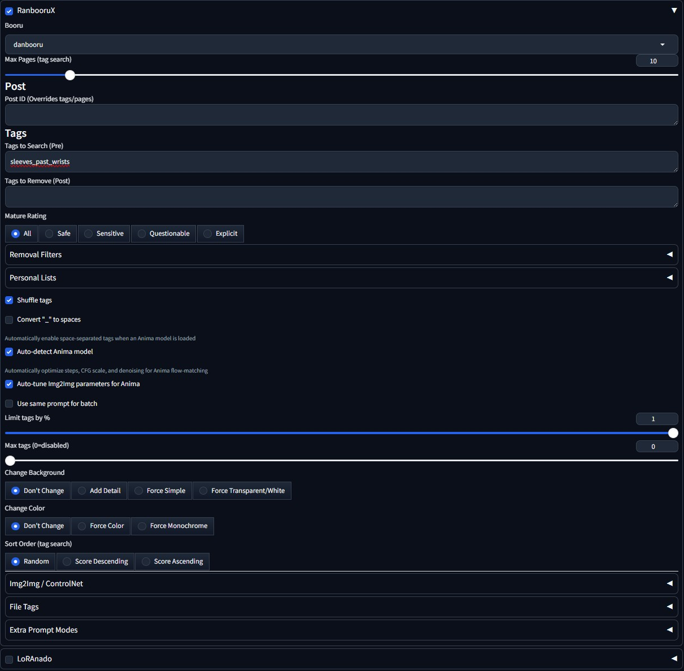
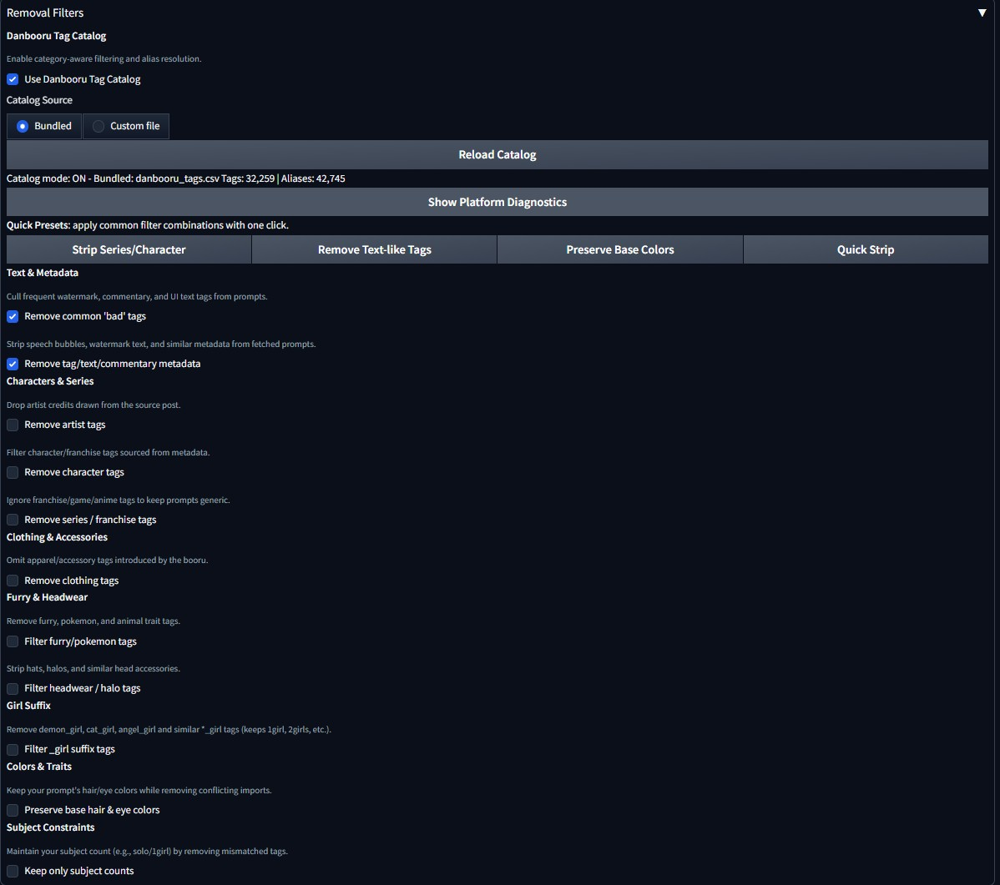

<div align="center">

# RanbooruX


RanbooruX is a fork of Ranbooru built **exclusively for Forge Neo**, featuring native support for **ADetailer Neo**.

</div>

It fetches booru tags and source images, builds prompts, and supports a two-stage generation flow with Img2Img, ControlNet handoff, and ADetailer / ADetailer Neo postprocessing.



## Features & Exclusive Fork Capabilities

RanbooruX delivers massive architectural and feature upgrades over original Ranbooru:

- **Forge Neo & ADetailer Neo Native Support**: Built exclusively for Forge Neo, with full support for ADetailer Neo and standard ADetailer in two-pass Img2Img workflows.
- **Anima (2B DiT) Support**: Native auto-detection of Anima models with automatic flow-matching scheduler tuning, prompt quality prefixes, and working basic Img2Img & ControlNet LLLite support.
- **Danbooru Tag Catalog System**: Bundled tag catalog (`data/catalogs/danbooru_tags.csv`) providing alias normalization, category-aware filtering, custom CSV import, and hair/eye color preservation.
- **Safer Two-Pass Img2Img & Guarded Postprocessing**: Preview guard suppresses initial-pass flashes until final img2img outputs are rendered; guarded script runner prevents script collisions.
- **Rich Booru & Tag Removal Filters**: Multi-booru search (`aibooru`, `danbooru`, `e621`, `gelbooru`, `konachan`, `rule34`, `safebooru`, `xbooru`, `yande.re`) with fine-grained removal toggles (artist, character, series, clothing, commentary, furry, headwear, `*_girl` suffix cleanup).
- **LoRAnado Random LoRA Injection**: Automatic detection and control surfaces for PonyXL & Anima-compatible LoRAs with blacklist support.
- **Modular Codebase & Quality Tooling**: Refactored from a monolithic script into a clean `ranboorux/` module with unit tests (`pytest`), strict type checking (`mypy`), linting (`ruff`), and formatting (`black`).
- **User Conveniences**: Favorites management, file-driven tag sources, prompt/source logging, and sensible caching.

## Installation

### Method 1: Install from URL in Forge Neo (Recommended)

1. Open **Forge Neo**.
2. Navigate to the **Extensions** tab -> **Install from URL** sub-tab.
3. Paste the URL of this repository into **URL for extension's git repository**:
   `https://github.com/soficis/sd-webui-ranbooruX`
4. Click **Install**.
5. Restart **Forge Neo** or click **Apply and restart UI**.

### Method 2: Manual Installation

1. Copy or clone this repository to your WebUI extensions directory:
   - `extensions/sd-webui-ranbooruX`
2. Start or restart WebUI.
3. `install.py` installs extension dependencies from `requirements.txt`.
4. Open the **RanbooruX** panel.

<details>
<summary><b>Environment Configuration Overrides</b></summary>

If your Forge Neo ControlNet extension is located in a custom or non-standard directory outside of `extensions/sd_forge_controlnet` or `extensions-builtin/sd_forge_controlnet`, RanbooruX supports optional environment variables to override the ControlNet detection path:

* `SD_FORGE_CONTROLNET_PATH`: Primary override pointing to the root directory of `sd_forge_controlnet` (containing `lib_controlnet/external_code.py`).
* `RANBOORUX_CN_PATH`: Secondary fallback override path for RanbooruX ControlNet asset resolution.

#### How to Configure

##### Option 1: In WebUI Startup Scripts (Recommended)
Add the environment variable directly to your WebUI launcher so it persists across restarts:

* **Windows (`webui-user.bat`)**:
  ```cmd
  set SD_FORGE_CONTROLNET_PATH=C:\path\to\sd_forge_controlnet
  ```
* **Linux / macOS (`webui-user.sh`)**:
  ```bash
  export SD_FORGE_CONTROLNET_PATH="/path/to/sd_forge_controlnet"
  ```

##### Option 2: Terminal / Shell

* **Windows PowerShell**:
  ```powershell
  $env:SD_FORGE_CONTROLNET_PATH="C:\path\to\sd_forge_controlnet"
  ```
* **Windows Command Prompt (`cmd.exe`)**:
  ```cmd
  set SD_FORGE_CONTROLNET_PATH=C:\path\to\sd_forge_controlnet
  ```
* **Linux / macOS (`bash` / `zsh`)**:
  ```bash
  export SD_FORGE_CONTROLNET_PATH="/path/to/sd_forge_controlnet"
  ```

</details>

## Quick Start & Usage Workflow

RanbooruX integrates prompt fetching, tag catalog processing, two-pass generation, ControlNet handoff, and postprocessing into a streamlined workflow:

1. **Select Source & Query Tags**: Choose a booru source (`danbooru`, `gelbooru`, `e621`, etc.), enter your desired search tags, and specify post limits.
2. **Apply Tag Catalog & Removal Filters**: Keep `Use Danbooru Tag Catalog` enabled (default ON) for alias normalization and category-aware filtering. Configure tag removal toggles to strip unwanted artist/character/clothing metadata.
3. **Configure Image Handoff (Optional)**:
   - Check `Use Image for Img2Img` to run an initial pass followed by an Img2Img pass with automatic denoising caps.
   - Check `Use Image for ControlNet (Unit 0)` to automatically pass the fetched booru image into Forge Neo's ControlNet Unit 0 slot.
4. **Enable Postprocessing (Optional)**: Check `Enable RanbooruX ADetailer support` to automatically run a guarded manual ADetailer or ADetailer Neo pass on the final outputs.
5. **Generate**: Click **Generate** — RanbooruX fetches posts, processes prompts, and executes the multi-pass pipeline automatically.

## Tag Filters & Catalog Processing

RanbooruX provides powerful tag filtering and catalog normalization to keep prompts clean and coherent.



### Danbooru Tag Catalog

RanbooruX includes a bundled catalog used by the tag-catalog pipeline.

- Bundled file: `data/catalogs/danbooru_tags.csv`
- Catalog mode toggle: `Use Danbooru Tag Catalog` (default ON)
- Source selection: `Bundled` or `Custom file`

With catalog mode enabled (default), the pipeline provides:
- Alias normalization (maps variant tags to canonical Danbooru tags)
- Category-aware tag filtering (artist, character, series, meta, general)
- Smart hair & eye color preservation
- Textual & commentary tag cleanup

### Custom Catalog Files

Custom CSV catalogs can be imported into `user/catalogs/` via the UI.

Accepted formats:
- Header-based CSV (`tag,category,count,alias`)
- Headerless 4-column CSV (`tag,category,count,alias`)

Validation and management buttons (`Validate CSV`, `Import Custom Catalog`, `Reload Catalog`) are provided in the UI.

## Two-Pass Img2Img + ADetailer / ADetailer Neo Pipeline

For Img2Img workflows, RanbooruX executes a coordinated multi-stage process:

1. **Initial Pass & Preview Guard**: Generates the base image while suppressing intermediate preview flashes until final images are rendered.
2. **Img2Img Pass**: Automatically applies tuned denoising caps to refine details without breaking composition.
3. **ControlNet Handoff**: When `Use Image for ControlNet (Unit 0)` is enabled, the fetched booru reference image is automatically assigned to Unit 0 in Forge Neo's ControlNet runner.
4. **ADetailer / ADetailer Neo Pass**: Runs a guarded postprocessing pass on the final images, auto-detecting both standard ADetailer and ADetailer Neo scripts.

## Anima Model Support

RanbooruX natively supports **Anima** (a 2B parameter DiT model by CircleStone Labs + Comfy Org built on NVIDIA Cosmos-Predict2) in Forge Neo with basic Img2Img support fully working.

### Anima ControlNet Support

RanbooruX supports **basic ControlNet Img2Img & conditioning handoff** for Anima models.

Anima uses a 2B Diffusion Transformer (DiT) architecture, which requires specialized **ControlNet-LLLite** models rather than standard SD/SDXL ControlNets:

- **Available LLLite Models**: `anima-lllite-lineart-1` (line art / pose guidance), `anima-lllite-depth-1` (depth estimation guidance), `anima-lllite-inpainting-v2` (targeted inpainting).
- **How to Use**:
  1. Open Forge Neo's **ControlNet** panel (Unit 0 tab).
  2. Select an Anima LLLite model (`anima-lllite-lineart-1` or `anima-lllite-depth-1`) and matching preprocessor (`anime_lineart` or `depth`).
  3. In RanbooruX, check **`Use Image for ControlNet (Unit 0)`**.
  4. Click **Generate** — RanbooruX automatically passes the fetched booru image to Unit 0.
- **Scope & Limitations**: RanbooruX handles standard ControlNet LLLite image handoff into Unit 0. Anima Edit (Cosmos-Reference) is not supported.

### How "ControlNet Unit 0" Works in Forge Neo

In Forge Neo, ControlNet units are 0-indexed under the hood:
- **Unit 0** corresponds to the **1st ControlNet tab/accordion slot** in Forge Neo's ControlNet interface.
- When **`Use Image for ControlNet (Unit 0)`** is enabled, RanbooruX automatically fetches the target booru image and populates Unit 0's control image slot before triggering generation.

### Understanding & Customizing Anima Settings

When an Anima model is loaded and **`Auto-detect Anima model`** is enabled:
- **Tag Formatting**: Automatically converts underscores (`_`) to spaces (e.g. `blue_hair` → `blue hair`) for Anima's Qwen3 text encoder.
- **Default Quality Prefix**: Auto-prepends `masterpiece, best quality, score_7, safe, ` if no quality tags are present.
- **Default Negative Prompt**: Auto-fills default negative prompt (`worst quality, low quality, score_1, score_2...`) if negative prompt is empty.
- **Customization**: Uncheck **`Auto-detect Anima model`** to bypass default quality prefixes and negative prompts for 100% custom prompt construction.

### How to Control Anima Sampler Tuning

RanbooruX includes dedicated UI controls for Anima sampler and step optimization:

- **`Auto-tune Img2Img parameters for Anima`** (`anima_tune_img2img`, default ON):
  - **When Enabled**: Automatically optimizes step counts, CFG scale (3.0–6.0), and denoising strength (capped at 0.5) tuned for Anima's flow-matching scheduler during Img2Img passes.
  - **When Disabled**: RanbooruX preserves your manual step count, CFG scale, and denoising strength set in Forge Neo, giving full manual control to users who prefer custom sampler settings.

### Recommended Settings
- CFG: 4–5
- Steps: 30–50
- Sampler: Euler a or er_sde
- Resolution: 512²–1536²
- Clip Skip: 1

## RanbooruX vs Original Ranbooru

Original Ranbooru was a monolithic single-script extension (~1.1k lines). RanbooruX is a complete overhaul built specifically for Forge Neo:

| Aspect | Original Ranbooru | RanbooruX |
| --- | --- | --- |
| **Target Platform** | Legacy SD WebUI / A1111 | Exclusively **Forge Neo** & **ADetailer Neo** |
| **Architecture** | Single file (`scripts/ranbooru.py`) | Modular package (`ranboorux/`) + script wrappers |
| **Anima Model Support** | None | Full auto-detection, quality defaults, working Img2Img & ControlNet (LLLite) |
| **ADetailer Integration** | None / basic script calling | Guarded two-pass runner supporting ADetailer & ADetailer Neo |
| **Tag Processing** | Ad-hoc string replacements | Bundled Danbooru Tag Catalog (`data/catalogs/danbooru_tags.csv`) |
| **Testing & Quality** | No tests | Complete `pytest` test suite, `mypy`, `ruff`, `black` & CI |
| **Dependency Management** | Implicit / unmanaged | Automated via `requirements.txt` & `install.py` |

## Forge Neo Technical Notes

- Target Platform: Developed and tested **strictly for Forge Neo only**. Other WebUI distributions are not supported or tested.
- ControlNet integration is designed for Forge Neo and tested only in that environment.
- Deepbooru support has been removed in RanbooruX.
- The previously bundled `scripts/controlnet.py` has been removed; runtime integration dynamically resolves external/builtin ControlNet paths.
- InputAccordion includes compatibility fallbacks for environments where it is unavailable.
- Gradio update calls are routed through compatibility helpers for Gradio 3/4 behavior.

## Developer & Verification Guide

RanbooruX uses a modular architecture with comprehensive automated tests, linting, and type safety checks.

### Repository Architecture
- `scripts/ranbooru.py`: WebUI Extension entry point and Gradio UI definition.
- `ranboorux/`: Core modular package (catalog pipeline, booru API clients, ADetailer runtime/orchestration, ControlNet integration, Anima model detection).
- `tests/`: Automated test suite covering wrappers, catalog processing, ADetailer runtime, and lifecycle contracts.
- `tools/`: CI helper scripts (`check_no_gradio_update.py`, `repo_guard.py`).

### Cross-Platform Development Commands

Run tests, linters, and type checkers locally in your operating system environment:

#### Windows (PowerShell)
```powershell
$env:PYTHONPATH="."
python -m pytest tests/ -q
python -m ruff check scripts/ranbooru.py ranboorux tests tools install.py
python -m black --check scripts/ranbooru.py ranboorux tests tools install.py
python -m mypy ranboorux --warn-return-any --warn-unused-ignores
```

#### Windows (Command Prompt `cmd.exe`)
```cmd
set PYTHONPATH=.
python -m pytest tests/ -q
python -m ruff check scripts/ranbooru.py ranboorux tests tools install.py
python -m black --check scripts/ranbooru.py ranboorux tests tools install.py
python -m mypy ranboorux --warn-return-any --warn-unused-ignores
```

#### Linux / macOS (`bash` / `zsh`)
```bash
PYTHONPATH=. python3 -m pytest tests/ -q
PYTHONPATH=. python3 -m ruff check scripts/ranbooru.py ranboorux tests tools install.py
PYTHONPATH=. python3 -m black --check scripts/ranbooru.py ranboorux tests tools install.py
PYTHONPATH=. python3 -m mypy ranboorux --warn-return-any --warn-unused-ignores
```

## LoRAnado (PonyXL & Anima detection)

> [!NOTE]
> LoRAnado is a legacy feature inherited from original Ranbooru.

LoRAnado includes detection and control surfaces to reduce incompatible LoRA picks in PonyXL and Anima workflows.

Controls:
- `Auto-detect PonyXL/Anima-compatible LoRAs`
- `Scan LoRAs`
- `Select All Compatible`
- `Detected LoRAs (toggle enabled)`
- `LoRAnado blacklist`

Detection matches PonyXL and Anima model signatures based on filename tokens and model metadata keys. If no compatible LoRAs are detected, RanbooruX falls back to all LoRAs in the target directory.

## Credits

- Original Ranbooru by Inzaniak
