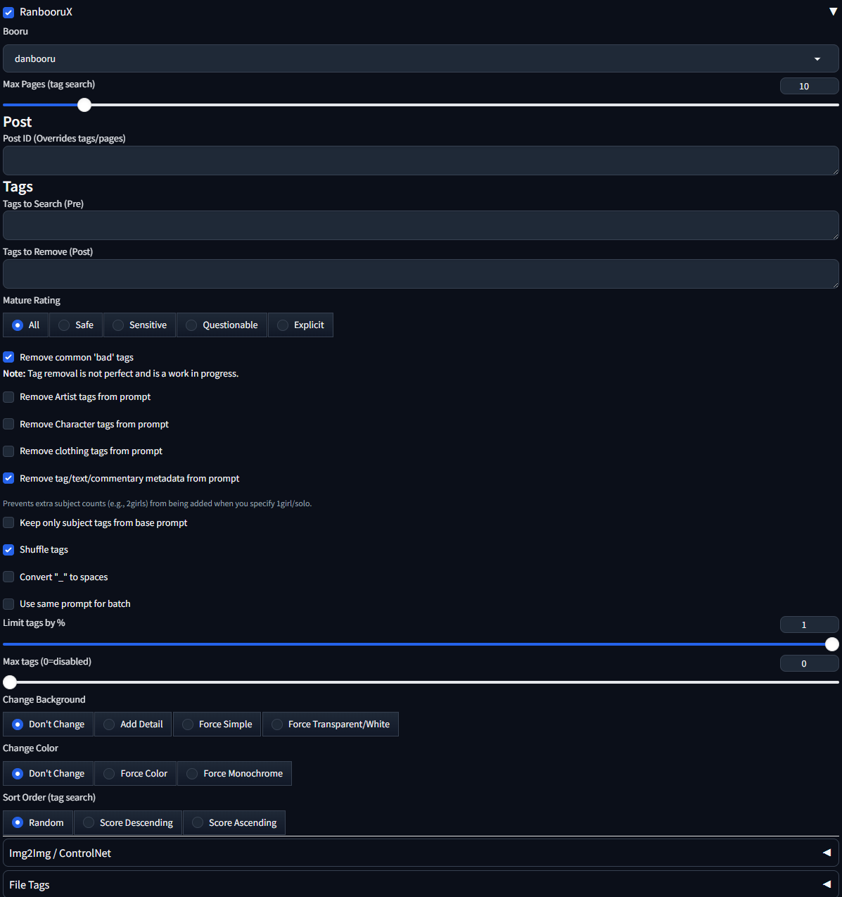

<div align="center">

# RanbooruX


RanbooruX is a fork of Ranbooru for Stable Diffusion WebUI environments focused on **Forge Neo**.

</div>

It fetches booru tags and source images, builds prompts, and supports a two-stage generation flow with optional Img2Img, ControlNet handoff, and ADetailer postprocessing.

## Platform support

> [!IMPORTANT]
> **Project Owner Testing Disclaimer**: This project is strictly developed and tested **only using Forge Neo**. Other WebUI distributions (including original SD WebUI / Automatic1111 and original SD WebUI Forge) are **not tested** by the repository owner.

## Why this fork?

- Fix brittle Img2Img/ControlNet interactions and make them **reliable on Forge Neo**.
- Split the old “remove bad tags” into **clear, no‑surprise filters**.
- Make installs easy with `requirements.txt` and a bundled ControlNet helper.
- Add **favorites**, **file‑driven prompts**, **logging**, and **sensible caching**.
- 

## Installation

### Method 1: Install from URL in Forge Neo (Recommended)

1. Open **Forge Neo**.
2. Navigate to the **Extensions** tab -> **Install from URL** sub-tab.
3. Paste the URL of this repository into **URL for extension's git repository**:
   `https://github.com/soficis/sd-webui-ranbooruX`
4. Click **Install**.
5. Restart **Forge Neo** or click **Apply and restart UI**.

### Method 2: Manual Installation

1. Copy or clone this repository to your WebUI extensions directory:
   - `extensions/sd-webui-ranbooruX`
2. Start or restart WebUI.
3. `install.py` installs extension dependencies from `requirements.txt`.
4. Open the **RanbooruX** panel.

Optional environment overrides for ControlNet detection:

- `SD_FORGE_CONTROLNET_PATH`
- `RANBOORUX_CN_PATH`

## Quick start

1. Select a booru source.
2. Enter tags and generate.
3. Optional: enable `Use Image for Img2Img`.
4. Optional: enable `Use Image for ControlNet (Unit 0)`.
5. Optional: enable `Enable RanbooruX ADetailer support`.

## Key features

- Booru sources: `aibooru`, `danbooru`, `e621`, `gelbooru`, `gelbooru-compatible`, `konachan`, `rule34`, `safebooru`, `xbooru`, `yande.re`
- Fine-grained removal filters (artist, character, series, clothing, text/commentary, furry, headwear, `*_girl`, subject constraints, preserve hair/eye colors, and more)
- `Quick Strip` one-click removal preset (instantly activates all major removal filters for aggressive prompt cleanup)
- Danbooru tag catalog normalization/filtering (enabled by default, toggleable)
- Img2Img and ControlNet handoff flow
- Optional manual ADetailer pass after Img2Img
- LoRAnado random LoRA injection with PonyXL & Anima compatibility controls (legacy feature)
- Platform diagnostics panel for runtime visibility
- Caching, file-driven tag sources, favorites, and prompt/source logging

## Removal filters and Quick Strip

`Quick Strip` sets all major removal toggles to ON in one click, including:

- common bad tags
- textual/commentary metadata
- artist/character/series tags
- clothing/furry/headwear tags
- `*_girl` suffix cleanup
- preserve hair/eye colors
- subject-count constraints

This is intended for aggressive prompt cleanup and can be tuned afterward.

## Gelbooru-specific behavior

- `Gelbooru API Key` and `Gelbooru User ID` controls are shown only for Gelbooru.
- `Gelbooru: Fringe Benefits` is shown only when `Booru` is `gelbooru`.
- Credentials can be saved to `user/gelbooru/credentials.json` from UI.

## Danbooru Tag Catalog

RanbooruX includes a bundled catalog used by the redesigned tag-catalog pipeline.

- Bundled file: `data/catalogs/danbooru_tags.csv`
- Catalog mode toggle: `Use Danbooru Tag Catalog` (default ON)
- Source selection: `Bundled` or `Custom file`

With catalog mode enabled (default), the catalog pipeline adds:

- alias normalization
- category-aware filtering
- better hair/eye preservation behavior
- textual/meta tag cleanup backed by catalog categories
- diagnostics panel for kept/dropped/unknown tag insight

When the toggle is disabled, RanbooruX still uses the bundled catalog path (catalog-only mode; no legacy filter engine).

### Custom catalog files

Custom CSV catalogs are supported and imported into `user/catalogs/`.

Accepted formats:

- Header-based CSV (`tag,category,count,alias`)
- Headerless 4-column CSV (`tag,category,count,alias`)

Validation/import controls:

- `Validate CSV`
- `Import Custom Catalog`
- `Reload Catalog`

Implementation details and format notes are documented in:

- `data/catalogs/README.txt`
- `ranboorux/catalog.py`

### Bundled catalog provenance and licensing notes

`data/catalogs/README.txt` includes provenance/licensing context for the bundled `danbooru_tags.csv`, plus references used for the research notes.

## LoRAnado (PonyXL & Anima detection)

> [!NOTE]
> LoRAnado is a legacy feature inherited from original Ranbooru and is not extensively tested by the repository owner.

LoRAnado includes detection and control surfaces to reduce incompatible LoRA picks in PonyXL and Anima workflows.

Controls:

- `Auto-detect PonyXL/Anima-compatible LoRAs`
- `Scan LoRAs`
- `Select All Compatible`
- `Detected LoRAs (toggle enabled)`
- `LoRAnado blacklist`

### Detection behavior

Detection prefers strict compatibility signals:

1. Filename token matches (word-boundary aware):
   - PonyXL: `pony`, `pony xl`, `pony-diffusion`, `ponydiffusion`, `pdxl`, `xlp`
   - Anima: `anima`
2. Metadata matches from relevant base-model/architecture keys only
   - avoids scanning unrelated metadata fields that previously caused false positives

If no compatible LoRAs are detected, RanbooruX falls back to all LoRAs in the selected folder so generation is still usable.

## Two-pass Img2Img + ADetailer notes

For Img2Img workflows, RanbooruX runs an initial pass, then a dedicated Img2Img pass, then optional manual ADetailer processing.

> [!NOTE]
> Img2Img is currently **not tested with Anima models/LoRAs**.

Important behavior:

- first-pass previews are suppressed until final images are ready (preview guard)
- final results are forced back into processed image state for extension/UI consistency
- ADetailer integration uses guarded manual execution to reduce script collisions

## Verification status

The repository includes automated tests for compatibility wrappers, catalog behavior, parsing, and integration boundaries.

Recommended checks:

```bash
PYTHONPATH=/path/to/sd-webui-ranbooruX pytest -q
PYTHONPATH=/path/to/sd-webui-ranbooruX pytest -q --gradio-version=4
python3 -m py_compile scripts/ranbooru.py
```

## Forge/Forge Neo compatibility notes

- Deepbooru support has been removed in RanbooruX.
- The previously bundled `scripts/controlnet.py` has been removed; runtime integration resolves external/builtin ControlNet paths.
- InputAccordion has a fallback for environments where it is unavailable.
- Gradio update calls are routed through compatibility helpers for Gradio 3/4 behavior.

## RanbooruX vs Original Ranbooru

- Project scope: original Ranbooru is mostly a single-script extension; RanbooruX adds a modular package (`ranboorux/`), a full `tests/` suite, CI/pre-commit/tooling config, and contributor/testing docs.
- Core implementation: `scripts/ranbooru.py` is heavily expanded/refactored (about 1.1k lines in original vs about 5.8k lines here) with compatibility wrappers and integration boundaries for Forge Neo.
- Feature set: RanbooruX adds Danbooru tag-catalog processing (bundled/custom CSV + validation/import), `Quick Strip`, richer removal filters, and a diagnostics panel.
- Integration flow: RanbooruX hardens Img2Img + ControlNet + ADetailer behavior on Forge Neo with safer two-pass processing and guarded/manual ADetailer execution.
- LoRAnado: RanbooruX introduces PonyXL & Anima-aware LoRA detection/selection controls and blacklist support.
- Deepbooru Removal: Deepbooru support has been removed in RanbooruX.
- Compatibility/dependencies: RanbooruX switches installer behavior to `requirements.txt`-driven installs with expanded deps (for example `requests`, `Pillow`, `timm`).

## Credits

- Original Ranbooru by Inzaniak
