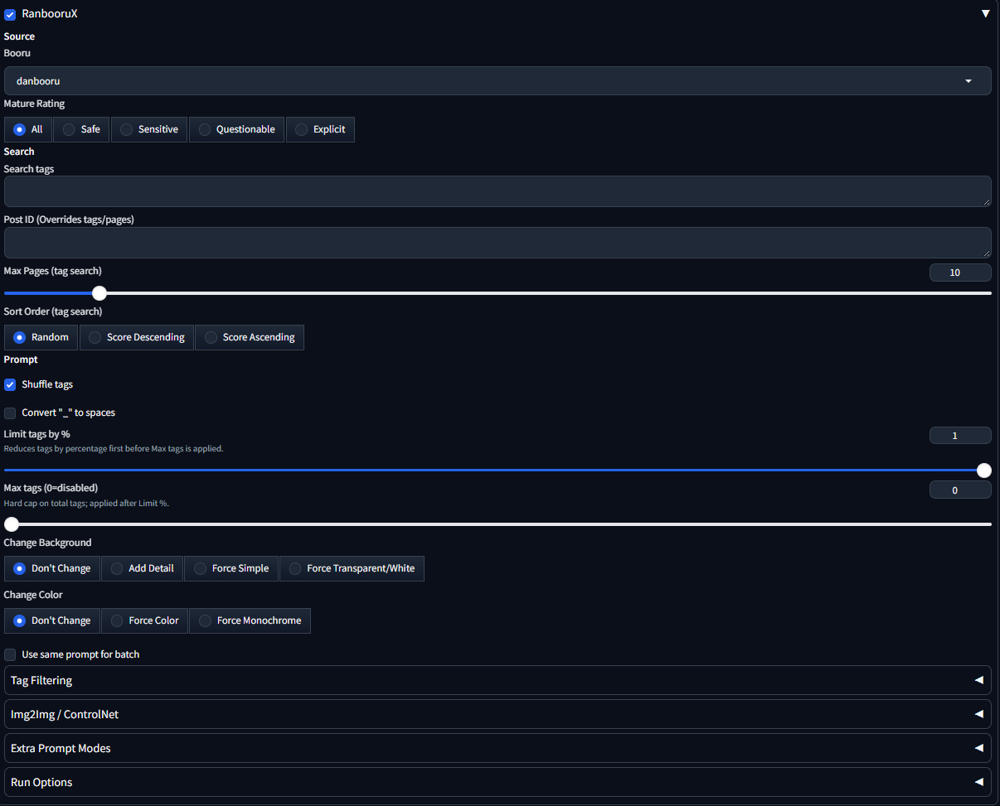
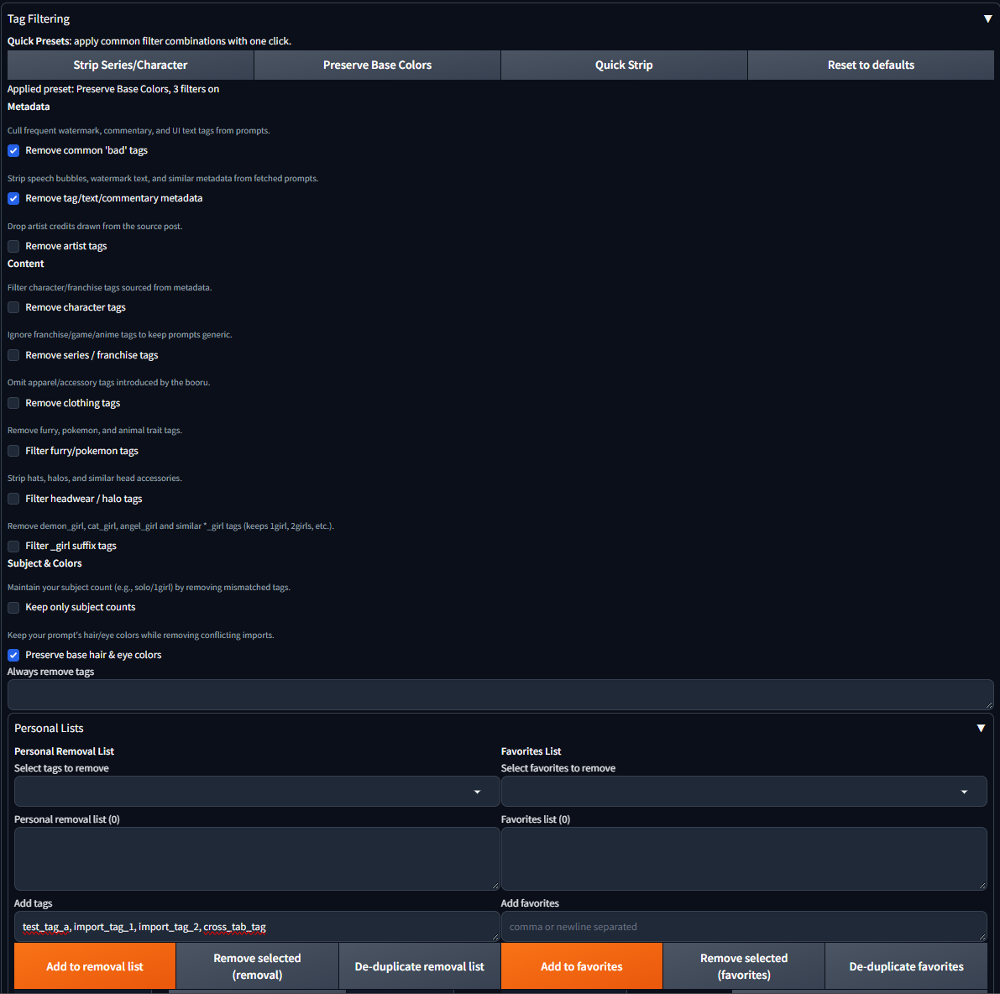
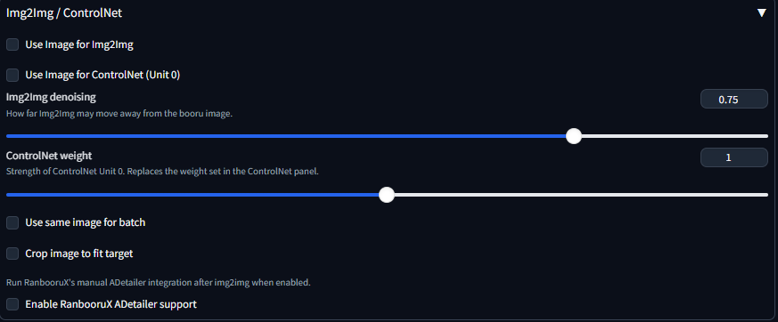

<div align="center">

# RanbooruX


RanbooruX turns one search tag into a finished image, and you never write the prompt.

</div>

RanbooruX is a fork of Ranbooru for **Forge Neo**. It picks a booru post that matches your tags. It builds the prompt from that post's tags. It can also feed the post's image to Img2Img, ControlNet, and ADetailer.



## What it does

- **Fetches posts.** Ten sources: `danbooru`, `gelbooru`, `gelbooru-compatible`, `xbooru`, `rule34`, `safebooru`, `konachan`, `yande.re`, `aibooru`, `e621`.
- **Cleans tags.** A bundled Danbooru catalog fixes aliases and sorts tags by category. Filters strip artists, characters, series, clothing, and text.
- **Reuses the image.** Img2Img starts from the booru image. ControlNet Unit 0 can follow its shape.
- **Runs ADetailer last.** ADetailer and ADetailer Neo both work on the final image.
- **Knows Anima.** RanbooruX detects Anima checkpoints and adjusts tags, quality prefix, CFG, and denoising.
- **Reports each run.** A one-line summary appears under the image. Failures appear there too.

## Install

### From URL (recommended)

1. Open **Forge Neo**.
2. Go to **Extensions** → **Install from URL**.
3. Paste `https://github.com/soficis/sd-webui-ranbooruX`.
4. Click **Install**.
5. Restart Forge Neo.

### Manual

1. Clone this repository into `extensions/sd-webui-ranbooruX`.
2. Restart Forge Neo. `install.py` installs `requests`, `requests-cache`, and `Pillow`.
3. Open the **RanbooruX** panel.

<details>
<summary><b>ControlNet in a non-standard folder</b></summary>

RanbooruX looks for ControlNet in `extensions/sd_forge_controlnet` and `extensions-builtin/sd_forge_controlnet`. Two environment variables override that:

* `SD_FORGE_CONTROLNET_PATH`: the root of `sd_forge_controlnet`. It must contain `lib_controlnet/external_code.py`.
* `RANBOORUX_CN_PATH`: a fallback path.

Set the variable in your launcher so it survives restarts.

* **Windows (`webui-user.bat`)**:
  ```cmd
  set SD_FORGE_CONTROLNET_PATH=C:\path\to\sd_forge_controlnet
  ```
* **Linux / macOS (`webui-user.sh`)**:
  ```bash
  export SD_FORGE_CONTROLNET_PATH="/path/to/sd_forge_controlnet"
  ```
* **PowerShell (current session only)**:
  ```powershell
  $env:SD_FORGE_CONTROLNET_PATH="C:\path\to\sd_forge_controlnet"
  ```

</details>

## Quick start

1. Tick the **RanbooruX** checkbox to enable it.
2. Pick a **Booru** and a **Mature Rating**.
3. Type **Search tags**. Or enter a **Post ID** to use one exact post.
4. Click **Generate**.

RanbooruX fetches up to **Max Pages** pages and picks a post. **Sort Order** decides how: random, highest score, or lowest score. The post's tags join your own prompt.

Gelbooru needs an API key and a user ID. The fields appear when you select it.

### Prompt controls

| Control | Effect |
|---|---|
| `Shuffle tags` | Randomizes tag order. |
| `Convert "_" to spaces` | Turns `blue_hair` into `blue hair`. |
| `Limit tags by %` | Keeps a share of the tags. Runs first. |
| `Max tags (0=disabled)` | Caps the tag count. Runs second. |
| `Change Background` / `Change Color` | Forces a background or color style. |
| `Use same prompt for batch` | Gives every image in the batch one prompt. |

**Extra Prompt Modes** adds `Mix tags from multiple posts` and `Shuffle tags (chaos)`. **Run Options** holds seed, cache, logging, and Anima switches.

## Tag filtering



Each checkbox removes one kind of tag. Four preset buttons set several at once:

| Preset | Use it to |
|---|---|
| `Strip Series/Character` | Drop artists, characters, and series. |
| `Preserve Base Colors` | Keep the hair and eye colors from your prompt. |
| `Quick Strip` | Turn on all eleven filters. |
| `Reset to defaults` | Return to bad-tag and text removal only. |

Every preset keeps bad-tag and text removal on.

`Always remove tags` takes a list of tags you never want.

### Personal lists

**Personal Lists** stores two lists on disk: a removal list and a favorites list. You can add, remove, de-duplicate, import (`.txt` or `.csv`), and export. Export writes a fresh copy into a box below the button. Click the box to download it.

### Danbooru tag catalog

`Use Danbooru Tag Catalog` is on by default. The catalog lives at `data/catalogs/danbooru_tags.csv`. It does three jobs:

- It maps tag variants to the canonical Danbooru tag.
- It tells the filters which tags are artists, characters, series, or metadata.
- It protects hair and eye colors when you ask it to.

You can load your own catalog. Upload a CSV, then click **Import Custom Catalog**. RanbooruX copies it to `user/catalogs/`. **Validate CSV** checks a file first. **Reload Catalog** rereads it.

The CSV has four columns: `tag,category,count,alias`. A header row is optional.

## Img2Img and ControlNet



| Control | Effect |
|---|---|
| `Use Image for Img2Img` | Starts the final image from the booru image. |
| `Use Image for ControlNet (Unit 0)` | Sends the booru image to ControlNet Unit 0. |
| `Img2Img denoising` | Sets how far Img2Img may move from the booru image. |
| `ControlNet weight` | Sets Unit 0's strength, 0 to 2. Default 1.0. |
| `Use same image for batch` | Uses one booru image for the whole batch. |
| `Crop image to fit target` | Crops to your width and height. Off, RanbooruX picks a size that fits the image's shape. |
| `Enable RanbooruX ADetailer support` | Runs ADetailer on the final image. |

### What happens when Img2Img is on

Forge always runs its own generation first. RanbooruX cannot stop it. So RanbooruX shrinks it to **one step** and throws the result away. You pay a second or two.

Then the real work starts:

1. **Img2Img** runs your full step count on the booru image.
2. **ControlNet** joins that pass if you ticked it.
3. **ADetailer** fixes faces on the result.

RanbooruX hides previews until the final image is ready.

Three limits apply to the Img2Img pass:

- Denoising caps at 0.6. Anima caps at 0.5.
- CFG is held between 4 and 8. Anima uses 3 to 6. Anima turbo uses 1 to 6.
- With Img2Img on, RanbooruX rejects posts that break your filters **before** download. A filtered tag would still be in the picture.

### What you need for ControlNet

1. Open Forge Neo's main **ControlNet** panel. ADetailer has its own ControlNet section. That one is separate.
2. Select a **model** and a **preprocessor** in **Unit 0**, the first tab.
3. Tick `Use Image for ControlNet (Unit 0)` in RanbooruX.

RanbooruX supplies the image and the weight. Your `ControlNet weight` slider replaces the weight in the ControlNet panel. Other units you enabled run too.

With Img2Img on, ControlNet shapes the Img2Img pass. With Img2Img off, it shapes the normal generation.

### When something is missing

RanbooruX tells you under the image.

| Problem | Result |
|---|---|
| Unit 0 has no model | ControlNet is skipped. Img2Img still runs. |
| A post has no downloadable image | RanbooruX picks from the posts that have one. |
| The download fails anyway | Img2Img is skipped. You get a normal full-step image from the booru prompt. |

### ADetailer

ADetailer uses your real step count, not the one-step placeholder. Many faces mean many passes. Set separate steps inside ADetailer if runs take too long.

## Supported models

Forge Neo ships 15 diffusion engines. RanbooruX treats them differently:

| Model family | What RanbooruX does |
|---|---|
| **Anima** (base, aesthetic, turbo, 2.9B, 3.8B) | Detects the checkpoint. Adds a quality prefix. Keeps score tags. Tunes Img2Img. |
| **PonyXL** | Does not detect the checkpoint. LoRAnado detects Pony-compatible LoRA files. |
| **SD 1.5 / SDXL / Illustrious / NoobAI** | Standard booru tag handling. |
| **Flux, Flux2, Chroma, Lumina2, Wan, QwenImage, ZImage, Krea2, ErnieImage, PiD, Mugen** | No detection. The default prompt pipeline applies. These models prefer prose to tags. |

## Anima

Anima is a DiT model from CircleStone Labs and Comfy Org. RanbooruX detects it from the loaded checkpoint.

`Auto-detect Anima model` (default on) does three things:

- It converts underscores to spaces and keeps `score_*` tags intact.
- It prepends `masterpiece, best quality, score_7, safe, ` when your prompt has no quality tags. The aesthetic variant gets no `score_7`.
- It fills an empty negative prompt with `worst quality, low quality, score_1, score_2, score_3, ...`.

Untick it to write the whole prompt yourself.

`Auto-tune Img2Img parameters for Anima` (default on) applies the Anima caps above. Untick it and the general caps apply instead: denoising 0.6, CFG 4 to 8. Your step count is never changed.

Anima uses **ControlNet-LLLite** models in Forge Neo, not standard SD or SDXL ControlNets. Pick an LLLite model in Unit 0.

Settings that work well:

- CFG: 4–5
- Steps: 30–50
- Sampler: Euler a or er_sde
- Resolution: 512² to 1536²
- Clip Skip: 1

## LoRAnado

> [!NOTE]
> LoRAnado is a legacy feature from the original Ranbooru.

LoRAnado adds random LoRAs to the prompt. It finds PonyXL-compatible LoRAs by filename and metadata. If it finds none, it uses every LoRA in the folder. It does not detect Anima LoRAs.

Controls: `Auto-detect PonyXL-compatible LoRAs`, `Scan LoRAs`, `Select All Compatible`, `Detected LoRAs (toggle enabled)`, `LoRAnado blacklist`.

## RanbooruX vs original Ranbooru

| Aspect | Original Ranbooru | RanbooruX |
| --- | --- | --- |
| **Platform** | SD WebUI / A1111 | Forge Neo only |
| **Code** | One 1,100-line script | `ranboorux/` package plus `scripts/ranbooru.py` |
| **Anima** | None | Detection, quality defaults, Img2Img tuning |
| **ControlNet** | Bundled copy | Uses Forge Neo's ControlNet, on the final pass |
| **ADetailer** | None | ADetailer and ADetailer Neo on the final image |
| **Tags** | String replacement | Danbooru tag catalog |
| **Quality checks** | None | `pytest`, `mypy`, `ruff`, `black`, CI |

## Limits

- RanbooruX is tested on Forge Neo only. Other WebUIs are unsupported.
- Deepbooru support is gone.
- The bundled `scripts/controlnet.py` is gone. RanbooruX finds Forge Neo's ControlNet at run time.
- A sampler that cannot run one step will break the placeholder pass. Euler-family samplers work.

## For developers

- `scripts/ranbooru.py`: the extension entry point and the Gradio UI.
- `ranboorux/`: catalog, booru clients, ADetailer and ControlNet integration, Anima detection.
- `tests/`: the `pytest` suite.
- `tools/`: CI helpers such as `check_no_gradio_update.py` and `repo_guard.py`.

CI runs these commands. Run them before you push.

#### Windows (PowerShell)
```powershell
$env:PYTHONPATH="."
python tools/check_no_gradio_update.py
python -m pytest tests/ -q
python -m pytest tests/ -q --gradio-version=4
python -m ruff check scripts/ranbooru.py ranboorux tests tools install.py
python -m black --check scripts/ranbooru.py ranboorux tests tools install.py
python -m mypy ranboorux --warn-return-any --warn-unused-ignores
```

#### Linux / macOS
```bash
export PYTHONPATH=.
python3 tools/check_no_gradio_update.py
python3 -m pytest tests/ -q
python3 -m pytest tests/ -q --gradio-version=4
python3 -m ruff check scripts/ranbooru.py ranboorux tests tools install.py
python3 -m black --check scripts/ranbooru.py ranboorux tests tools install.py
python3 -m mypy ranboorux --warn-return-any --warn-unused-ignores
```

## Upgrade notes

Forge saves your UI defaults in `ui-config.json` by control label. Several labels changed. Defaults you saved for those controls reset once. New defaults save under the new labels.

| Control | Old label | New label | Note |
|---|---|---|---|
| Textbox | `Tags to Search (Pre)` | `Search tags` | |
| Textbox | `Tags to Remove (Post)` | `Always remove tags` | |
| Radio | `Tag Shuffling (Chaos)` | `Shuffle tags (chaos)` | |
| Slider | `Img2Img Denoising / CN Weight` | `Img2Img denoising` | Img2Img strength only. |
| Slider | *(new)* | `ControlNet weight` | 0 to 2, default 1.0. Replaces the weight in the ControlNet panel. |
| Textbox | `Custom CSV Path (...)` | `Custom catalog path` | |
| Dropdown | `Removal Tags` | `Select tags to remove` | Starts empty. It only picks tags to delete. |
| Dropdown | `Favorite Tags` | `Select favorites to remove` | Starts empty. It only picks tags to delete. |
| File | `Upload CSV` | `Upload CSV, then click Import` | |
| Button | `Remove Text-like Tags` | *(removed)* | `Reset to defaults` covers it. |
| Button | *(new)* | `Reset to defaults` | |
| Button | `Add` | `Add to removal list` / `Add to favorites` | |
| Button | `Remove Selected` | `Remove selected (removal)` / `Remove selected (favorites)` | |
| Button | `De-duplicate` | `De-duplicate removal list` / `De-duplicate favorites` | |
| Button | `Export` | `Export removal list` / `Export favorites` | Writes a copy into the `Exported ...` box. Click the box to download. |
| File | *(new)* | `Exported removal list` / `Exported favorites` | Hidden until the first export. |
| Button | `Refresh` | `Refresh search files` / `Refresh remove files` | |
| File | `Import CSV/TXT` | `Import removal list (CSV/TXT)` / `Import favorites (CSV/TXT)` | |

Two behaviors also changed:

- With Img2Img on, ControlNet now shapes the final image. Before, it shaped a first pass that RanbooruX discarded.
- ADetailer now runs your full step count. Before, it inherited a reduced count.

## Credits

- Original Ranbooru by Inzaniak
