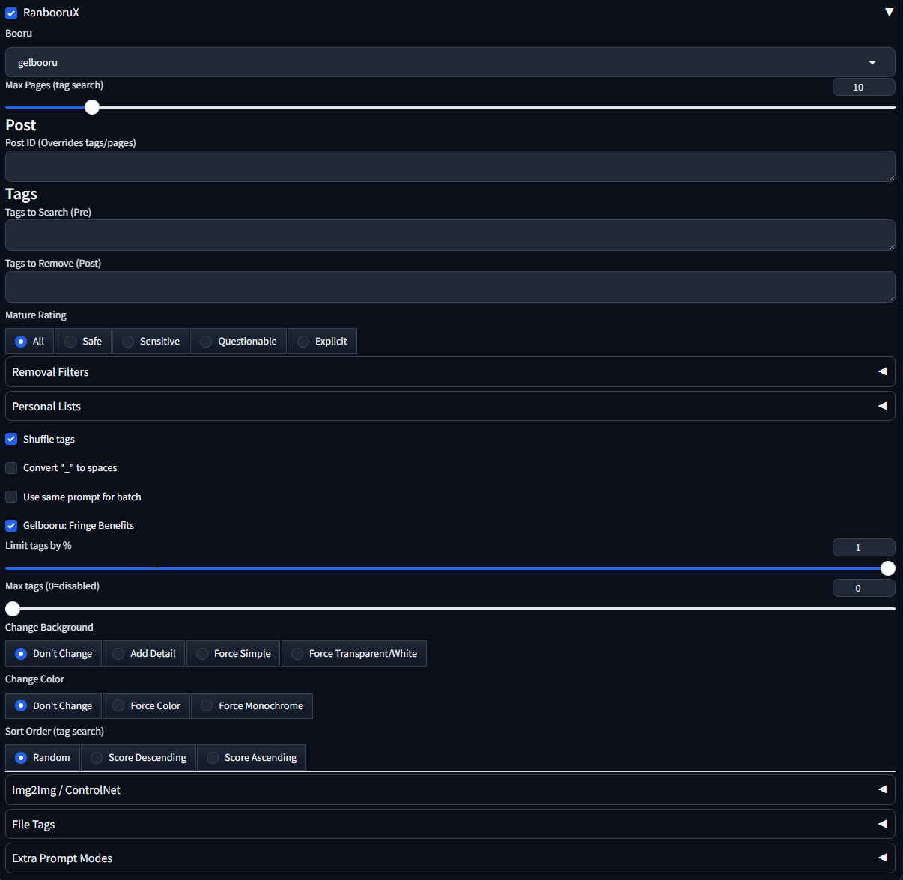
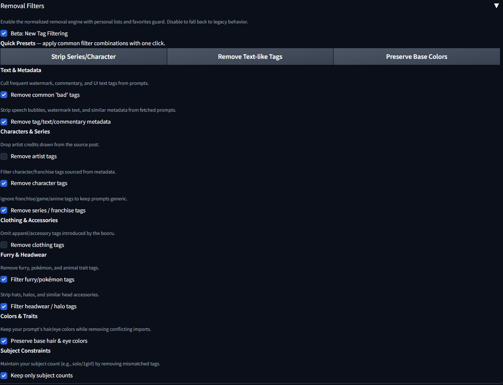

# RanbooruX

**RanbooruX** is an enhanced fork of the Ranbooru extension for the Automatic1111/Forge Stable Diffusion WebUI.  
It pulls tags from popular boorus to build varied prompts, with robust **img2img**, **optional ControlNet handoff**, and **optional ADetailer** post‑processing.

> Tested primarily on **Forge**. Compatible with A1111.

## Why this fork?
- Fix brittle img2img/ControlNet interactions and make them **reliable on Forge**.
- Split the old “remove bad tags” into **clear, no‑surprise filters**.
- Make installs easy with `requirements.txt` and a bundled ControlNet helper.
- Add **favorites**, **file‑driven prompts**, **logging**, and **sensible caching**.
- 

## Installation

1. **Clone or copy** this repo into your WebUI’s extensions folder:  
   `extensions/sd-webui-ranbooruX`
2. Start/reload the WebUI. The installer will run:
   - RanbooruX dependencies via **`requirements.txt`**  
   - (Optional) bundled **ControlNet helper** requirements
3. Look for the **“RanbooruX”** panel in the UI.

> Advanced: You can point RanbooruX at a specific Forge ControlNet install with `SD_FORGE_CONTROLNET_PATH` or `RANBOORUX_CN_PATH` before launch.

## Quick start

1. Pick a **Booru** (e.g. `gelbooru`). If you choose Gelbooru, enter your API key and user ID when prompted—you can optionally save them for future sessions. Note: Since Gelbooru is the default selection, you may need to choose a different booru first, then reselect Gelbooru to make the credential fields appear.  
2. Click **Generate** to fetch tags and build a prompt.  
3. (Optional) Enable **Use Image for Img2Img** and set **Denoising** for image‑to‑image.  
4. (Optional) Toggle **Use Image for ControlNet (Unit 0)** to pass the same source image to ControlNet.  
5. (Optional) Enable **ADetailer support** to post‑process each result.

You can stop here and it already works. The rest of the options are for finer control.

## Features overview

- **Booru Tagging** — Choose from: aibooru, danbooru, e621, gelbooru, gelbooru-compatible, konachan, rule34, safebooru, xbooru, yande.re
- **Gelbooru credential manager** — Enter API key & user ID inline, optionally save them to `user/gelbooru/credentials.json`, and clear them anytime.
- **Granular filters** — Artist • Character • Series • Clothing • Furry/Pokémon • Headwear • Keep base hair/eye colors • Enforce subject count
- 
- **Danbooru Tag Catalog (optional)** - Bring your own `danbooru_tags.csv` to drive alias normalization, copyright/character filtering, and textual tag removal with live diagnostics. (Details in [Danbooru Tag Catalog](#danbooru-tag-catalog-optional).)
- **Prompt hygiene** — Remove common “bad” tags; strip commentary/metadata; shuffle; convert underscores
- **Batch controls** — Same prompt/seed/image per batch; mix tags from multiple posts; chaos amount
- **File inputs** — Add a line from `user/search/*.txt|csv`; remove via `user/remove/*.txt|csv`; import CSV/TXT; favorites
- **Pipelines** — Img2Img; ControlNet handoff; optional ADetailer pass
- **Caching & Logging** — Cache API responses; optionally reuse fetched posts; write prompt/source logs
- **LoRA helpers** — Lock previous LoRAs; random LoRA amount & weights

## Danbooru Tag Catalog (optional)

RanbooruX can consume a Danbooru tag catalog to drive alias normalization and category-aware filtering. The extension never bundles tag data, so you must supply your own CSV (for example [Hugging Face: newtextdoc1111/danbooru-tag-csv](https://huggingface.co/datasets/newtextdoc1111/danbooru-tag-csv)). When the catalog toggle is enabled you get:

- **Alias awareness** – canonicalises booru aliases before filtering so prompt tags stay consistent.
- **Category-driven filtering** – honours the existing “Remove series/character/text tags” toggles with real category IDs instead of heuristics.
- **Hair/Eye preservation** – the `Preserve base hair & eye colors` option expands to every colour that appears in the catalog.
- **Textual/meta cleanup** – drops watermark/commentary tags defined in the catalog without touching allowlisted hair/eye tags.
- **Diagnostics panel** – shows ON/OFF status, counts of kept/dropped/normalised tags, and top suggestions for unknown tags.

### Enabling the catalog

1. Open **Removal Filters** and toggle **Use Danbooru Tag Catalog (optional)**.
2. Paste the absolute path to your `danbooru_tags.csv`. The path is saved to `user/tag_catalog.json` for later sessions.
3. Use **Reload Catalog** whenever you update the CSV. RanbooruX also hot-reloads on the next search if the file timestamp changes.
4. Check the **Tag Filtering Diagnostics** accordion for a quick summary of what the catalog changed.

Disable the toggle at any time to fall back to the legacy heuristics.

## All controls (explained)

| Control | Type | Default | What it does |
|---|---|---|---|
| `Booru` | Dropdown | gelbooru | Select which booru API to fetch tags from. |
| `Gelbooru API Key` | Textbox |  | Visible only when Gelbooru is selected; enter the API key from your Gelbooru account (required). |
| `Gelbooru User ID` | Textbox |  | Visible only when Gelbooru is selected; enter your Gelbooru user ID (required). |
| `Save Credentials to Disk` | Button |  | Writes Gelbooru credentials to `user/gelbooru/credentials.json` so fields stay hidden next time. |
| `Clear Saved Credentials` | Button |  | Deletes the saved Gelbooru credential file so you can re-enter new values. |
| `Beta: New Tag Filtering` | Checkbox | true | Enable the normalized removal engine with personal lists and favorites guard. Disable to fall back to legacy behavior. |
| `Use Danbooru Tag Catalog (optional)` | Checkbox | false | Toggle catalog-backed alias and category filtering. Requires a user-supplied `danbooru_tags.csv`. |
| `CSV Path` | Textbox |  | Absolute path to your `danbooru_tags.csv`. Visible only when the catalog toggle is enabled and persisted between sessions. |
| `Reload Catalog` | Button |  | Reloads the CSV immediately (otherwise it hot-reloads the next time you fetch tags). |
| `Remove common 'bad' tags` | Checkbox | true | Cull frequent watermark, commentary, and UI text tags from prompts. |
| `Remove tag/text/commentary metadata` | Checkbox | true | Strip speech bubbles, watermark text, and similar metadata from fetched prompts. |
| `Remove artist tags` | Checkbox | false | Drop artist credits drawn from the source post. |
| `Remove character tags` | Checkbox | false | Filter character/franchise tags sourced from metadata. |
| `Remove series / franchise tags` | Checkbox | false | Ignore franchise/game/anime tags to keep prompts generic. |
| `Remove clothing tags` | Checkbox | false | Omit apparel/accessory tags introduced by the booru. |
| `Filter furry/pokémon tags` | Checkbox | false | Remove furry, pokémon, and animal trait tags. |
| `Filter headwear / halo tags` | Checkbox | false | Strip hats, halos, and similar head accessories. |
| `Preserve base hair & eye colors` | Checkbox | false | Keep your prompt's hair/eye colors while removing conflicting imports. |
| `Keep only subject counts` | Checkbox | false | UI control carried over from Ranbooru with the same general purpose. |
| `Removal Tags` | Dropdown | personal_choices | UI control carried over from Ranbooru with the same general purpose. |
| `Add tags` | Textbox |  | UI control carried over from Ranbooru with the same general purpose. |
| `Import CSV/TXT` | File |  | UI control carried over from Ranbooru with the same general purpose. |
| `Favorite Tags` | Dropdown | favorite_choices | Manage a list of favorite tags that can be appended or protected from removal. |
| `Add favorites` | Textbox |  | Manage a list of favorite tags that can be appended or protected from removal. |
| `Import CSV/TXT` | File |  | UI control carried over from Ranbooru with the same general purpose. |
| `Shuffle tags` | Checkbox | true | Randomizes the order of collected tags before building the prompt. |
| `Convert "_" to spaces` | Checkbox | false | Replaces underscores with spaces in tags in the final prompt. |
| `Use same prompt for batch` | Checkbox | false | Uses exactly the same prompt for every image in the batch. |
| `Gelbooru: Fringe Benefits` | Checkbox | true | Gelbooru-only option that enables the site’s 'fringe benefits' behavior for broader tag results. |
| `Limit tags by %` | Slider | 1.0 | Limits the number of tags included in the final prompt. |
| `Change Background` | Radio | "Don't | Apply simple color/background overrides to tags that support them. |
| `Change Color` | Radio | "Don't | Apply simple color/background overrides to tags that support them. |
| `Use Image for Img2Img` | Checkbox | false | Sends the source image to the selected pipeline (Img2Img or ControlNet). |
| `Img2Img Denoising / CN Weight` | Slider | 0.75 | Sends the source image to the selected pipeline (Img2Img or ControlNet). |
| `Use same image for batch` | Checkbox | false | UI control carried over from Ranbooru with the same general purpose. |
| `Crop image to fit target` | Checkbox | false | Center-crops the image to the target resolution/aspect. |
| `Use Deepbooru on image` | Checkbox | false | Runs Deepbooru on the source image and injects the predicted tags. |
| `DB Tags Position` | Radio | "Add | Where to place Deepbooru tags in relation to the Ranbooru tags. |
| `Enable RanbooruX ADetailer support` | Checkbox | false | Run RanbooruX's manual ADetailer integration after img2img when enabled. |
| `Reuse cached booru posts` | Checkbox | false | Leave disabled to fetch fresh images every generation. Enable when you want RanbooruX to reuse the previously cached posts. |
| `Add line from Search File` | Checkbox | false | Appends one random line from your `user/search/*.txt` or `.csv` file to the prompt. |
| `Add tags from Remove File` | Checkbox | false | Removes this category of tags from fetched prompts. |
| `Mix tags from multiple posts` | Checkbox | false | Build prompts by mixing tags pulled from multiple different posts. |
| `Posts to mix` | Slider | 2 | How many distinct posts to mix together when building a prompt. |
| `Chaos Amount %` | Slider | 0.5 | Adds randomness to tag selection; higher values increase variation. |
| `Use same seed for batch` | Checkbox | false | Uses the same seed for all images in the batch for reproducibility. |
| `Cache Booru API requests` | Checkbox | true | Caches booru API responses to reduce network calls. |
| `Log image sources/prompts to txt` | Checkbox | false | When enabled, RanbooruX appends a log entry mapping seeds and prompts to the source posts. |
| `Lock previous LoRAs` | Checkbox | false | Prevents new LoRAs from replacing already-loaded ones. |
| `LoRAs Subfolder` | Textbox |  | UI control carried over from Ranbooru with the same general purpose. |
| `LoRAs Amount` | Slider | 1 | How many random LoRAs to load (if any). |
| `Min LoRAs Weight` | Slider | 0.6 | Weight range for randomly picked LoRAs. |
| `Max LoRAs Weight` | Slider | 1.0 | Weight range for randomly picked LoRAs. |

## Known issues (Inherited from Ranbooru, no fixes made)

- Chaos/negative modes may error with batch counts > 1 in some setups; retrying usually works.
- `sd-dynamic-prompts` can conflict with the multiple prompts option — disable that extension if you see odd prompts.

## Credits

- Original Ranbooru by **Inzaniak**  