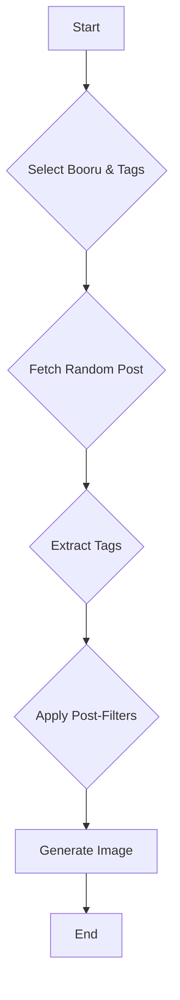
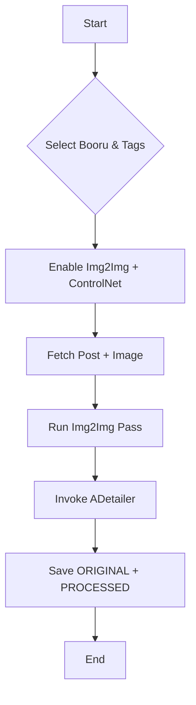

# Usage (RanbooruX)

> This is the RanbooruX usage guide. It supersedes the original Ranbooru guide.

# RanbooruX Usage Guide

> **Note**: This guide covers the `adetailer` branch -- a work-in-progress build that can layer optional manual ADetailer processing on top of RanbooruX's rebuilt Img2Img and ControlNet workflows. Toggle the new RanbooruX "Enable ADetailer support" checkbox whenever you want the extra pass. For project context, see the main [README.md](README.md).

## Core Workflows

### 1. Basic Search & Prompt Generation
This workflow fetches tags from a selected booru to generate a text prompt.

**Steps:**

1. **Select Booru**: Choose a source from the `Booru` dropdown (e.g., `danbooru`).
   - **Note for Gelbooru**: As of recent updates, Gelbooru requires an API key and user ID for access. If you select Gelbooru (which is the default), the credential fields may not appear immediately. To make them visible, first select a different booru from the dropdown, then reselect Gelbooru. Enter your API key and user ID from your Gelbooru account, and optionally save them to disk for future sessions.
2. **Add Search Tags**: In `Tags to Search (Pre)`, enter tags to filter posts, separated by commas.
   - *Example*: `1girl, solo, short_hair`
3. **Configure Options (Optional)**:
   - Adjust `Max Pages` to control the size of the random post pool.
   - Use `Tags to Remove (Post)` to filter out unwanted tags from the final prompt.
   - Enable `Use the same prompt for all images` for batch consistency.
4. **Generate**: Click the main "Generate" button in the WebUI. RanbooruX will fetch a random post matching your tags, extract its tags, and use them as the prompt.

**Workflow Diagram:**



### 2. Img2Img + ControlNet + ADetailer Workflow

This workflow pulls both the tags and source image from a booru post, feeds them into an Img2Img pass with ControlNet conditioning, and (when the RanbooruX ADetailer toggle is enabled) pushes the result through ADetailer.

**Before you start:**

- Open the ADetailer tab in the WebUI and enable the detector(s) you want (e.g., `face_yolov8n.pt`). This branch invokes the same settings you configure there.
- Optional but recommended: set "Inpaint only masked" and padding values suited to your subject. RanbooruX passes the entire processed image to ADetailer, so your usual presets apply.

**Steps:**

1. **Select Booru and Tags**: As with the basic search, choose a booru and provide search tags.
2. **Enable Img2Img**: Check the `Use img2img` box. RanbooruX will stage a lightweight txt2img warm-up pass and then launch the proper Img2Img job using the fetched source image.
3. **Enable ControlNet**: Check the `Send to ControlNet` box. RanbooruX will automatically push the fetched image into ControlNet Unit 0 using the fallback path when necessary.
4. **Enable RanbooruX ADetailer Support (Optional)**: Toggle `Enable RanbooruX ADetailer support` inside the RanbooruX panel when you want the extension to run the manual ADetailer pass. Leave it unchecked to keep the downstream pipeline untouched.
5. **Tune RanbooruX Img2Img Settings**: Set `Denoising Strength`, `Steps`, and any RanbooruX overrides (same prompt/image/seed for batch) as desired.
6. **Verify ControlNet Unit**: In the main UI, ensure Unit 0 is enabled and the right model and weight are selected. RanbooruX will sync the source preview once generation starts.
7. **Generate**: Click "Generate". Watch the console for `[R Post]` lines confirming ADetailer activation and `[R Post] ... _adetailer_PROCESSED` save paths.

#### Multi-Image Batch Tips

- When ADetailer support is enabled, RanbooruX runs each image in the batch sequentially through Img2Img and then ADetailer. Expect longer render times compared with vanilla batches.
- To reuse the same ControlNet conditioning for every frame, enable `Use same image for batch` and `Use same prompt for batch` inside the RanbooruX panel.
- If you need each image to fetch a new post, leave those options disabled; with the ADetailer toggle enabled RanbooruX will still route every result through ADetailer one by one.
- Keep an eye on VRAM usage when combining large ControlNet models with high-resolution batches. Lower `Denoising Strength` or resolution if you encounter OOM errors.

#### Result Files

- When ADetailer support is enabled, RanbooruX creates paired files in `outputs/img2img-images/<date>/`.
- `*_adetailer_ORIGINAL-####.png` is the plain Img2Img output saved for reference (with matching `.txt` metadata).
- `*_adetailer_PROCESSED-####.png` is the ADetailer-refined image that the UI also displays, again with matching metadata.
- The log will note `FINAL FIX: Patching ADetailer directly` and `SUCCESS: ADetailer processed img2img results` when the pipeline finishes. If you leave the new toggle off, expect only the base Img2Img outputs.

**Workflow Diagram:**



### 3. Using a Specific Post ID

If you already know the post you want to use, you can target it directly.

**Steps:**

1. **Select Booru**: Choose the correct booru for the post.
2. **Enter Post ID**: In the `Post ID` field, enter the numeric ID.
   - *Example*: For a post at `https://danbooru.donmai.us/posts/123456`, the ID is `123456`.
3. **Generate**: Click "Generate". The extension will fetch tags (and the image, if `img2img` is enabled) from that specific post.

### Using Custom Gelbooru-Compatible Sites

RanbooruX supports custom booru sites that are compatible with Gelbooru's API (DAPI). This allows you to fetch tags from sites like RealBooru, Scatbooru, or other Gelbooru forks.

**Steps:**

1. **Select Booru**: Choose `gelbooru-compatible` from the `Booru` dropdown.
2. **Enter Base URL**: In the `Gelbooru-compatible Base URL` field that appears, enter the base URL of the site (e.g., `https://realbooru.com`).
   - The URL should be the root of the site, without any path like `/index.php`.
3. **Add Search Tags**: Proceed as with other boorus, entering tags in `Tags to Search (Pre)`.
4. **Generate**: Click "Generate". RanbooruX will query the site's DAPI endpoint to fetch posts and tags.

**Notes:**
- Not all Gelbooru-compatible sites require credentials, but some may. If you encounter access issues, check the site's documentation for API keys.
- The system automatically tries JSON responses first, falling back to XML if needed.

### 4. Quick Checklist: Img2Img + ControlNet + ADetailer

Use this whenever you tweak your workflow:

- ADetailer tab enabled with the detectors you expect.
- `Enable RanbooruX ADetailer support` checked inside the RanbooruX panel when you want the manual pass.
- `Use img2img` and `Send to ControlNet` ticked in RanbooruX.
- ControlNet Unit 0 enabled with your chosen model.
- Console logs show `[R Post]` lines for the Img2Img pass followed by ADetailer saves.
- Output folder contains matching `_ORIGINAL` and `_PROCESSED` files.

## Advanced Features and Workflows

### Advanced Prompt Manipulation

RanbooruX offers several advanced modes to fine-tune and experiment with your prompts, giving you greater control over the final output.

- **Mixing Prompts**: When enabled, this feature constructs a single prompt by combining tags from multiple random posts. The **Mix Amount** slider determines how many posts are used.
- **Tag Shuffling (Chaos)**: This feature introduces controlled randomness by shuffling tags between your positive and negative prompts.
  - **Shuffle All**: Shuffles tags from both positive and negative prompts.
  - **Shuffle Negative**: Only shuffles tags in the negative prompt.
  - **Chaos Amount**: A percentage that controls the intensity of the shuffle.
- **File-Based Tag Management**:
  - **Add line from Search File**: Appends a random line from a `.txt` file in `user/search` to your query.
  - **Add tags from Remove File**: Extends the "Tags to Remove" list with tags from a `.txt` file in `user/remove`.
- **Tag Limiting**:
  - **Limit Tags by %**: Reduces the total number of tags by a percentage.
  - **Max tags**: Sets a hard limit on the total number of tags.

### Tag Filtering and Removal

RanbooruX includes advanced tag filtering capabilities to help you customize your prompts by removing unwanted tags.


#### Artist Tag Removal

- **Remove Artist tags from prompt**: When enabled, this feature automatically identifies and removes artist tags from the generated prompt
- **How it works**: The system extracts artist information from booru post metadata and removes matching tags from the final prompt
- **Supported boorus**: Works with all supported boorus that provide artist metadata (Danbooru, Gelbooru, etc.)
- **Matching**: Uses intelligent matching that handles both underscore and space formats (e.g., "artist_name" and "artist name")

#### Clothing Tag Removal

- **Remove clothing tags from prompt**: Filters apparel-related tags (uniforms, dresses, accessories, etc.) without stripping "no clothes" or similar states.
- **How it works**: RanbooruX matches against an expanded clothing keyword list and removes those tags after artist/character filtering runs.

#### Text & Commentary Removal

- **Remove tag/text/commentary metadata from prompt**: Strips out tags like `text`, `speech bubble`, `commentary`, and watermarks that often clutter prompts.
- **How it works**: Matches against a curated list of textual/meta tags (including `tagme`) and also removes patterns that include "text"/"commentary" substrings.

#### Preserve Requested Subject Tags

- **Keep only subject tags from base prompt**: When enabled, RanbooruX removes conflicting subject counts (e.g., `2girls`, `group`) unless they appear in your base prompt or initial additions.
- **How it works**: The script captures subject tags (`1girl`, `solo`, `1boy`, etc.) from your original prompt and prevents extra tags from the booru metadata from slipping back in.

#### Character Tag Removal

- **Remove Character tags from prompt**: When enabled, this feature automatically identifies and removes character tags from the generated prompt
- **How it works**: The system extracts character information from booru post metadata and removes matching tags from the final prompt
- **Pattern recognition**: For boorus that don't provide categorized tags, the system uses pattern matching to identify character tags (e.g., tags containing parentheses like "character_(series)")
- **Matching**: Uses normalized matching that handles case sensitivity and underscore/space variations

**Example Usage:**

1. Enable "Remove Artist tags from prompt" and "Remove Character tags from prompt"
2. Search for posts with tags like "1girl, solo"
3. The system will:
   - Extract artist tags like "artist_name" from the post metadata
   - Extract character tags like "character_(series)" from the post metadata
   - Remove these tags from the final prompt before generation
   - Result: A cleaner prompt focused on style and general tags rather than specific artists or characters

**Benefits:**

- Create more generic prompts for training or style studies
- Avoid over-fitting to specific artists or characters
- Generate variations without being tied to particular creators
- Useful for creating base prompts that can be reused across different styles

**Practical Examples:**

*Before enabling tag removal:*

```text
Original post tags: 1girl, solo, blue_eyes, blonde_hair, yagami_hayate_(nanoha), takamachi_nanoha, artist_name, score:150
Final prompt: 1girl, solo, blue_eyes, blonde_hair, yagami_hayate_(nanoha), takamachi_nanoha, artist_name
```

*After enabling "Remove Artist tags" and "Remove Character tags":*

```text
Original post tags: 1girl, solo, blue_eyes, blonde_hair, yagami_hayate_(nanoha), takamachi_nanoha, artist_name, score:150
Final prompt: 1girl, solo, blue_eyes, blonde_hair
```

```
Original post tags: 1girl, solo, blue_eyes, blonde_hair, yagami_hayate_(nanoha), takamachi_nanoha, artist_name, score:150
Final prompt: 1girl, solo, blue_eyes, blonde_hair, yagami_hayate_(nanoha), takamachi_nanoha, artist_name
```

*After enabling "Remove Artist tags" and "Remove Character tags":*

```
Original post tags: 1girl, solo, blue_eyes, blonde_hair, yagami_hayate_(nanoha), takamachi_nanoha, artist_name, score:150
Final prompt: 1girl, solo, blue_eyes, blonde_hair
```

*Use case - Style study:*

- Search for "1girl, solo, blue_eyes" on Danbooru
- Enable both artist and character tag removal
- Generate multiple images to study different artistic interpretations of the same basic concept
- Result: Prompts focused on style elements rather than specific characters or artists

### LoRAnado: Automated LoRA Integration
LoRAnado automatically selects and applies one or more LoRAs to your prompt.

-   **LoRAs Subfolder**: Specify a subfolder in your `models/loras` directory to limit the random pool.
-   **LoRAs Amount**: The number of LoRAs to add to the prompt.
-   **Min/Max LoRAs Weight**: Sets the random weight range for each LoRA.
-   **Custom Weights**: Manually define weights for each LoRA, separated by commas (e.g., `0.8, 0.5, 1.0`).
-   **Lock previous LoRAs**: Reuses the same LoRAs and weights from the previous generation.

### Enhanced Batch Processing
-   **Use same prompt for batch**: Uses a single prompt for every image in the batch.
-   **Use same image for batch**: Uses the same source image for `img2img` or `ControlNet` across the batch.
-   **Use same seed for batch**: Uses a single seed for all images in the batch.

### File-Based Tag Management
RanbooruX supports external tag files for advanced prompt customization:

#### Search Tag Files (`extensions/ranbooruX/user/search/`)
-   **Format**: One tag combination per line (e.g., `artist_name, masterpiece`)
-   **Random Selection**: When enabled, randomly selects one line from the chosen file
-   **Integration**: Appends selected tags to your main search query
-   **Use Case**: Create themed tag collections or A/B test different tag combinations

#### Remove Tag Files (`extensions/ranbooruX/user/remove/`)
-   **Format**: One tag pattern per line
-   **Wildcard Support**: Use `*` for partial matches (e.g., `*hair` removes all hair-related tags)
-   **Integration**: Extends the "Tags to Remove" functionality
-   **Use Case**: Maintain consistent tag filtering across sessions

#### File Structure Example
```
extensions/ranbooruX/user/
├── search/
│   ├── artistic.txt     → "artist_focus, intricate_details"
│   ├── character.txt    → "character_focus, dynamic_pose"
│   └── style.txt        → "digital_art, concept_art"
└── remove/
    ├── generic.txt      → "text, watermark, signature"
    └── quality.txt      → "*logo, *username, low_quality"
```

#### Usage Example
1. Enable "Use tags_search.txt"
2. Select "artistic.txt" from dropdown
3. Tags "1girl, solo" + file selection → Final query: "1girl, solo, artist_focus, intricate_details"

### Advanced Tag Processing Architecture
RanbooruX uses a sophisticated multi-stage tag processing pipeline:

#### Stage 1: API Response Standardization
-   **Multi-Format Parsing**: Handles different API response formats (dict vs string tags)
-   **Intelligent Categorization**: Extracts artist/character tags from metadata
-   **Fallback Pattern Matching**: Uses regex for boorus without categorized APIs

#### Stage 2: Tag Filtering and Removal
-   **Artist Tag Removal**: Extracts from `tag_string_artist` or `tags['artist']`
-   **Character Tag Removal**: Uses pattern matching for `character_(series)` format
-   **Normalization**: Handles underscore ↔ space conversion and case sensitivity
-   **Wildcard Matching**: Supports `*` wildcards for partial tag removal

#### Stage 3: Tag Enhancement and Chaos
-   **Background/Color Injection**: Automatically adds/removes tags based on UI selections
-   **Chaos Modes**: "Shuffle All" or "Shuffle Negative" with percentage control
-   **Tag Mixing**: Combines tags from multiple posts with random selection
-   **Deduplication**: Removes duplicate tags while preserving order

#### Technical Implementation Details
```python
# Artist tag extraction example
artist_tags = []
if 'tag_string_artist' in post_data:
    artist_tags = [t.strip() for t in re.split(r'[,\s]+', post_data['tag_string_artist']) if t.strip()]

# Character tag pattern matching
character_patterns = [
    r'.*\(.*\).*',  # Contains parentheses (character_series)
    r'.*_.*series.*',  # Underscore series format
    r'.*genshin_impact.*',  # Known series patterns
    r'.*touhou.*',
    r'.*fate_.*'
]
```

### Image Caching and Refresh
RanbooruX automatically caches fetched images and posts to improve performance and consistency when generating multiple images with the same settings.

-   **Automatic Caching**: Images are automatically cached when first fetched and reused for subsequent generations with identical search parameters.
-   **Cache Behavior**: The cache is keyed by booru, tags, post ID, rating, and sorting order. Any change to these parameters will trigger a fresh fetch.
-   **Cache Persistence**: Cached data persists between generations but is automatically cleared when the WebUI session ends.

#### Cache Key Generation
The cache uses a composite key: `{booru}_{tags}_{post_id}_{mature_rating}_{sorting_order}`. This ensures that:
- Changing any search parameter invalidates the cache
- Different sorting methods use different cached results
- Post ID overrides always bypass cache

### Advanced Sorting Options
RanbooruX provides three sorting methods with different selection algorithms:

-   **Random**: Pure random selection from available posts.
-   **Score Descending**: Weighted random selection favoring higher-scored posts using exponential decay.
-   **Score Ascending**: Weighted random selection favoring lower-scored posts.

#### Weighted Random Algorithm
For score-based sorting, RanbooruX uses a mathematical weighting system:
- Posts are ranked by score (higher = better for Descending, lower = better for Ascending)
- Weights follow an exponential distribution to prefer top-ranked posts
- Formula: `weight[i] = exp(-k * rank[i])` where k controls preference strength

### Background and Color Transformations
RanbooruX can automatically modify image backgrounds and colors by injecting/removing tags:

#### Background Options
-   **Don't Change**: No background modifications
-   **Add Detail**: Adds tags like "outdoors", "indoors", "detailed_background"
-   **Force Simple**: Adds "simple_background" and removes detailed background tags
-   **Force Transparent/White**: Adds "transparent_background" or "white_background"

#### Color Options
-   **Don't Change**: No color modifications
-   **Force Color**: Removes black & white tags ("monochrome", "greyscale", "limited_palette")
-   **Force Monochrome**: Adds random B&W tag and removes color-related tags

#### Technical Implementation
Background and color transformations work by:
1. Analyzing your tag selection
2. Automatically adding appropriate tags to your query
3. Removing conflicting tags from the final prompt
4. Using intelligent tag mapping for consistent results

### Photopea Integration for In-Browser Editing
The bundled ControlNet module includes a direct integration with Photopea, a powerful online image editor.

**Workflow:**
1.  In a ControlNet unit, provide an input image.
2.  Click the **"Edit in Photopea"** icon (a blue 'P').
3.  An editor will open in a modal. Use its tools to modify your image.
4.  Click **"Accept"**. The edited image is sent back to the ControlNet unit.

## Technical Architecture Details

### Booru API Behavior and Compatibility

RanbooruX supports multiple booru APIs with different capabilities and limitations:

#### Danbooru (`danbooru.donmai.us`)
-   **Tag Query**: Single tag only (e.g., "1girl" works, "1girl solo" fails)
-   **Post ID Support**: ✅ Full support with direct post lookup
-   **Rating System**: Custom 4-tier system (All, Safe, Sensitive, Questionable, Explicit)
-   **Tag Format**: Structured JSON with categorized tags (artist, character, general)
-   **Rate Limiting**: Moderate; uses request caching to minimize API calls

#### Gelbooru (`gelbooru.com`)

- **Tag Query**: ✅ Multi-tag support with complex queries
- **Post ID Support**: ✅ Full support
- **Rating System**: Standard 3-tier (Safe, Questionable, Explicit)
- **Special Feature**: "Fringe Benefits" - enables access to additional content categories
- **Tag Format**: Flat tag strings with manual categorization
- **Authentication**: As of June 2025, the public API requires both an API key and user ID. RanbooruX prompts for these when you select Gelbooru from the dropdown. Since Gelbooru is the default selection, you may need to choose a different booru first, then reselect Gelbooru to make the credential fields appear. You can save the credentials to `user/gelbooru/credentials.json` for future sessions.

#### Gelbooru-Compatible (Custom Sites)

- **Tag Query**: ✅ Multi-tag support with complex queries
- **Post ID Support**: ✅ Full support
- **Rating System**: Standard 3-tier (Safe, Questionable, Explicit)
- **Tag Format**: Flat tag strings with manual categorization
- **Authentication**: Optional; some sites may require API keys or other credentials
- **Base URL**: Requires entering the site's base URL (e.g., `https://realbooru.com`) in the `Gelbooru-compatible Base URL` field that appears when this option is selected
- **Use Case**: Access custom or regional booru sites that use Gelbooru's DAPI (Danbooru API) format, such as RealBooru or other forks

#### Safebooru (`safebooru.org`)

- **Tag Query**: ✅ Multi-tag support
- **Post ID Support**: ✅ Full support
- **Rating System**: None (Safe content only)
- **Tag Format**: Flat strings with directory-based file URLs
- **Use Case**: SFW content generation

#### Rule34.xxx (`rule34.xxx`)

- **Tag Query**: ✅ Multi-tag support
- **Post ID Support**: ✅ Full support
- **Rating System**: Standard 3-tier
- **Tag Format**: Flat strings
- **Content Warning**: Primarily adult content

#### Konachan/Yande.re (`konachan.com`, `yande.re`)

- **Tag Query**: ✅ Multi-tag support
- **Post ID Support**: ❌ Not supported (API limitation)
- **Rating System**: Standard 3-tier
- **Tag Format**: Structured JSON with categorized tags
- **Quality Focus**: High-quality art collections

#### e621 (`e621.net`)

- **Tag Query**: ✅ Multi-tag support with complex queries
- **Post ID Support**: ❌ Not supported
- **Rating System**: Custom system
- **Tag Format**: Highly structured with species/artist/character categorization
- **Content Focus**: Furry/anthro content
```python
# Attempts to use ControlNet's official external_code API
cn_module = self._load_cn_external_code()
cn_units = cn_module.get_all_units_in_processing(p)
if cn_units and hasattr(cn_module, 'update_cn_script_in_processing'):
    # Direct unit manipulation
    cn_module.update_cn_script_in_processing(p, modified_units)
```

#### Fallback Path (Script Args)
```python
# Forge compatibility - manipulates p.script_args directly
args_target_list[enabled_idx] = True        # Enable unit
args_target_list[weight_idx] = denoising    # Set weight
args_target_list[image_idx] = image_data    # Set image
p.script_args = tuple(args_target_list)
```

#### Path Selection Logic
1. **Try External API**: Preferred for A1111 and compatible forks
2. **Fallback to Script Args**: Automatic fallback for Forge and similar
3. **Logging**: Clear indication of which path was used in console

### Image Processing Pipeline

RanbooruX processes images through multiple stages:

#### 1. Fetch and Validation
-   **URL Filtering**: Blocks external sites (Pixiv, Twitter) that don't provide direct access
-   **Format Detection**: Validates image extensions (.jpg, .png, .gif, .webp)
-   **Error Handling**: Graceful fallback for failed downloads

#### 2. Preprocessing for Img2Img
-   **Resize Algorithm**: Center crop with aspect ratio preservation
-   **Format Conversion**: Automatic RGB conversion
-   **Batch Handling**: Individual processing to avoid memory issues

#### 3. Postprocessing
-   **Individual Rendering**: Each image processed separately to prevent batch size conflicts
-   **Result Aggregation**: Combines individual results into final output
-   **Seed Management**: Incremental seeds for variety in batch processing

## Troubleshooting Guide

### Common Issues and Solutions

#### "Extension not loading" / SyntaxError
**Symptoms**: Extension fails to load with syntax errors
**Solutions**:
1. Check Python version compatibility (tested on 3.10+)
2. Verify all dependencies installed: `pip install -r requirements.txt`
3. Check for conflicting extensions
4. Review console logs for specific error messages

#### "No images found" / Empty Results
**Symptoms**: API returns no posts matching criteria
**Solutions**:
1. **Danbooru**: Use single tags only (remove spaces/commas)
2. **Check Ratings**: Ensure rating filter matches available content
3. **Verify Tags**: Test tags directly on booru website
4. **Page Limits**: Try lower "Max Pages" value (some boorus have stricter limits)

#### ControlNet Not Working
**Symptoms**: Images not sent to ControlNet despite enabling option
**Solutions**:
1. **Check Logs**: Look for "ControlNet configured" or "fallback" messages
2. **Unit 0**: Ensure ControlNet Unit 0 is enabled in UI
3. **Forge Users**: This is expected behavior - uses fallback method
4. **Image Format**: Ensure images are RGB format

#### Console Reports "Manual ADetailer support disabled"
- **Symptoms**: Console logs show `[R Post] Manual ADetailer support disabled; skipping manual ADetailer execution` and no `_adetailer_` files are written.
- **Fix**: Enable `Enable RanbooruX ADetailer support` in the Img2Img / ControlNet accordion and rerun the generation.

#### ADetailer Metadata Present but Image Is Unchanged
**Symptoms**: `_adetailer_PROCESSED` file looks identical to `_ORIGINAL`
**Solutions**:
1. Confirm your detectors are enabled in the ADetailer tab and that confidence thresholds are not set too high.
2. Lower the ADetailer confidence slider or increase mask dilation to capture the target region.
3. Try a higher denoising strength (0.6-0.8) for Img2Img so ADetailer has more room to inpaint.
4. Check the console for "Skipping RanbooruX postprocess" lines -- this is normal -- followed by `SUCCESS: ADetailer processed img2img results`.

#### Multiple Images Saved but Only First Is Refined
**Symptoms**: Later batch items stay unprocessed.
**Solutions**:
1. Ensure `Batch count` is set in the main UI, not `Batch size`. RanbooruX processes each image consecutively.
2. Leave the WebUI idle until the console prints `Img2Img finished.`; cancelling early interrupts ADetailer.
3. Verify there is enough disk space in `outputs/img2img-images` for additional processed files.

#### Memory Issues / Out of Memory
**Symptoms**: Generation fails with CUDA out of memory errors
**Solutions**:
1. **Reduce Batch Size**: Lower batch count in main UI
2. **Disable Cache**: Turn off API caching to reduce memory usage
3. **Image Size**: Use smaller target resolutions
4. **Restart WebUI**: Clear accumulated memory

#### Cached Images Not Updating
**Symptoms**: `!refresh` not working or old images still appearing
**Solutions**:
1. **Tag Cleaning**: Ensure `!refresh` is properly formatted with comma separation
2. **Cache Key**: Verify that search parameters actually changed
3. **Clear Cache**: Restart WebUI to clear all cached data
4. **Check Logs**: Look for "Forcing new image fetch" confirmation

#### Tag Removal Not Working
**Symptoms**: Artist/character tags still appearing in prompts
**Solutions**:
1. **Case Sensitivity**: Tags are normalized (underscore ↔ space)
2. **API Format**: Some boorus don't provide categorized tags - uses pattern matching
3. **Debug Mode**: Check console logs for tag extraction details
4. **Manual Removal**: Use "Tags to Remove" as fallback

#### Performance Issues
**Symptoms**: Slow API responses or generation delays
**Solutions**:
1. **Enable Caching**: Turn on "Cache API requests" for faster repeated queries
2. **Reduce Pages**: Lower "Max Pages" to speed up searches
3. **Network Issues**: Check internet connection and booru site status
4. **Concurrent Requests**: Avoid multiple simultaneous generations

### Debug Information Collection

When reporting issues, include:
1. **Console Logs**: Full RanbooruX output (look for `[R]` prefixed messages)
2. **Settings Used**: Booru, tags, all enabled options
3. **WebUI Version**: Forge/A1111 version and commit hash
4. **Error Traces**: Complete Python traceback if available

### Logging & Reference Tracking

- Enable "Log image sources/prompts to txt" to append a record to `user/logs/prompt_sources.txt`.
- Each generation entry includes the timestamp, booru, prompt(s), seed(s), and the originating post URL when available.
- Leave it disabled if you prefer not to persist this metadata.

## Important Notes
- **Logging**: RanbooruX logs canonical post URLs for all selected items (e.g., `https://danbooru.donmai.us/posts/<id>`) for easy reference.
- **Comment Stripping**: The bundled `Comments` script automatically strips prompt comments (`#`, `//`, `/* */`) before generation. Note: While this script is bundled with RanbooruX, it may not be necessary for all users depending on their workflow and other extensions.
- **Forge & ControlNet**: On Forge, ControlNet is integrated via a fallback that sets Unit 0 through `p.script_args`. This is expected behavior, as Forge's ControlNet does not expose the same programmatic helpers as A1111. A log line will indicate which integration path was used.

## Technical Details
RanbooruX includes significant under-the-hood improvements for stability and performance.

-   **Architecture**: The core scripts have been refactored into an Object-Oriented design, which improves error handling and simplifies maintenance.
-   **Stable Dependencies**: The extension bundles a stable copy of the ControlNet API and manages dependencies with `requirements.txt` to prevent conflicts with other extensions.
-   **Robust API Calls**: All communication with booru APIs is wrapped in error handling and caching logic to improve reliability and speed.

For a more detailed technical breakdown, please see the **Technical Enhancements** section in the main [README.md](README.md).


