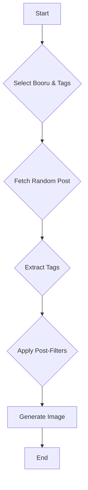
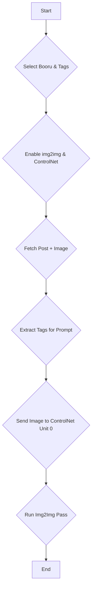

# RanbooruX Usage Guide

> **Note**: This repository is a heavily refactored fork of the original Ranbooru. Key `img2img` and `ControlNet` functionalities that are broken in the original have been fixed here. For a full overview of the project's purpose, see the main [README.md](README.md).

## Core Workflows

### 1. Basic Search & Prompt Generation
This workflow fetches tags from a selected booru to generate a text prompt.

**Steps:**
1.  **Select Booru**: Choose a source from the `Booru` dropdown (e.g., `danbooru`).
2.  **Add Search Tags**: In `Tags to Search (Pre)`, enter tags to filter posts, separated by commas.
    -   *Example*: `1girl, solo, short_hair`
3.  **Configure Options (Optional)**:
    -   Adjust `Max Pages` to control the size of the random post pool.
    -   Use `Tags to Remove (Post)` to filter out unwanted tags from the final prompt.
    -   Enable `Use the same prompt for all images` for batch consistency.
4.  **Generate**: Click the main "Generate" button in the WebUI. RanbooruX will fetch a random post matching your tags, extract its tags, and use them as the prompt.

**Workflow Diagram:**

### 2. Img2Img + ControlNet Workflow
This workflow uses both the tags and the source image from a booru post, feeding them into an `img2img` pass while conditioning the generation with ControlNet.

**Steps:**
1.  **Select Booru and Tags**: As with the basic search, choose a booru and provide search tags.
2.  **Enable `img2img`**: Check the `Use img2img` box.
3.  **Enable ControlNet**: Check the `Send to ControlNet` box.
4.  **Configure Parameters**:
    -   Set the `Denoising Strength` for the `img2img` pass (e.g., `0.75`).
    -   Ensure your ControlNet unit is enabled in the main WebUI `ControlNet` panel. RanbooruX will automatically send the source image to **Unit 0**.
5.  **Generate**: Click "Generate".

**Workflow Diagram:**

### 3. Using a Specific Post ID
If you already know the post you want to use, you can target it directly.

**Steps:**
1.  **Select Booru**: Choose the correct booru for the post.
2.  **Enter Post ID**: In the `Post ID` field, enter the numeric ID.
    -   *Example*: For a post at `https://danbooru.donmai.us/posts/123456`, the ID is `123456`.
3.  **Generate**: Click "Generate". The extension will fetch tags (and the image, if `img2img` is enabled) from that specific post.

## Advanced Features and Workflows

### Advanced Prompt Manipulation
RanbooruX offers several advanced modes to fine-tune and experiment with your prompts, giving you greater control over the final output.

-   **Mixing Prompts**: When enabled, this feature constructs a single prompt by combining tags from multiple random posts. The **Mix Amount** slider determines how many posts are used.
-   **Tag Shuffling (Chaos)**: This feature introduces controlled randomness by shuffling tags between your positive and negative prompts.
    -   **Shuffle All**: Shuffles tags from both positive and negative prompts.
    -   **Shuffle Negative**: Only shuffles tags in the negative prompt.
    -   **Chaos Amount**: A percentage that controls the intensity of the shuffle.
-   **File-Based Tag Management**:
    -   **Add line from Search File**: Appends a random line from a `.txt` file in `user/search` to your query.
    -   **Add tags from Remove File**: Extends the "Tags to Remove" list with tags from a `.txt` file in `user/remove`.
-   **Tag Limiting**:
    -   **Limit Tags by %**: Reduces the total number of tags by a percentage.
    -   **Max tags**: Sets a hard limit on the total number of tags.

### LoRAnado: Automated LoRA Integration
LoRAnado automatically selects and applies one or more LoRAs to your prompt.

-   **LoRAs Subfolder**: Specify a subfolder in your `models/loras` directory to limit the random pool.
-   **LoRAs Amount**: The number of LoRAs to add to the prompt.
-   **Min/Max LoRAs Weight**: Sets the random weight range for each LoRA.
-   **Custom Weights**: Manually define weights for each LoRA, separated by commas (e.g., `0.8, 0.5, 1.0`).
-   **Lock previous LoRAs**: Reuses the same LoRAs and weights from the previous generation.

### Enhanced Batch Processing
-   **Use same prompt for batch**: Uses a single prompt for every image in the batch.
-   **Use same image for batch**: Uses the same source image for `img2img` or `ControlNet` across the batch.
-   **Use same seed for batch**: Uses a single seed for all images in the batch.

### Photopea Integration for In-Browser Editing
The bundled ControlNet module includes a direct integration with Photopea, a powerful online image editor.

**Workflow:**
1.  In a ControlNet unit, provide an input image.
2.  Click the **"Edit in Photopea"** icon (a blue 'P').
3.  An editor will open in a modal. Use its tools to modify your image.
4.  Click **"Accept"**. The edited image is sent back to the ControlNet unit.

## Important Notes
- **Logging**: RanbooruX logs canonical post URLs for all selected items (e.g., `https://danbooru.donmai.us/posts/<id>`) for easy reference.
- **Comment Stripping**: The bundled `Comments` script automatically strips prompt comments (`#`, `//`, `/* */`) before generation.
- **Forge & ControlNet**: On Forge, ControlNet is integrated via a fallback that sets Unit 0 through `p.script_args`. This is expected behavior, as Forge’s ControlNet does not expose the same programmatic helpers as A1111. A log line will indicate which integration path was used.

## Technical Details
RanbooruX includes significant under-the-hood improvements for stability and performance.

-   **Architecture**: The core scripts have been refactored into an Object-Oriented design, which improves error handling and simplifies maintenance.
-   **Stable Dependencies**: The extension bundles a stable copy of the ControlNet API and manages dependencies with `requirements.txt` to prevent conflicts with other extensions.
-   **Robust API Calls**: All communication with booru APIs is wrapped in error handling and caching logic to improve reliability and speed.

For a more detailed technical breakdown, please see the **Technical Enhancements** section in the main [README.md](README.md).